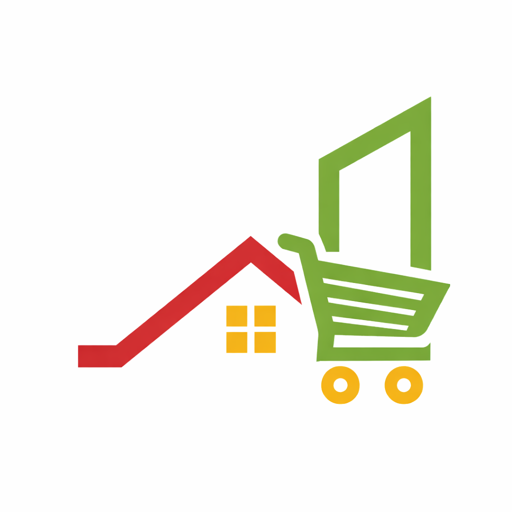

# Babon

<p align="center">
  
</p>

Babon is a Flutter-based mobile app (my first one) designed for ordering construction materials on demand. Babon provides a smooth experience from browsing to ordering via WhatsApp and managing your cart.

Babon

## Features

- **Authentication**: Easy to use Google Sign-In using Firebase Authentication.
- **Product Catalog**: Browse construction materials sorted by categories with real-time Firestore synchronization.
- **Shopping Cart**: Add your materials to a local cart persisted via Cloud Firestore.
- **WhatsApp Integration**: Quickly place your orders directly through WhatsApp.
- **Order Tracking**: Keep track of all your past orders with timestamps.
- **Responsive UI**: Intuitive, visually appealing, and scalable interface.

## Getting Started

Follow these instructions to get a copy of the project up and running on your local machine.

### Prerequisites

* Flutter SDK (version 3.11.4 or higher)
* Android Studio / VS Code
* An active Firebase Project configured for this application

### Installation

1. **Clone the repository:**
   ```bash
   git clone [your-repository-url]
   cd babon_ag
   ```

2. **Fetch dependencies:**
   ```bash
   flutter pub get
   ```

3. **Firebase Setup:**
   Ensure your `google-services.json` (for Android) and `GoogleService-Info.plist` (for iOS) are correctly configured and placed in their respective directories. You can also configure using the FlutterFire CLI if preferred.

4. **Run the App:**
   ```bash
   flutter run
   ```

## Technologies Used

* **Flutter Framework** - For cross-platform UI.
* **Firebase (Core, Auth, Firestore)** - For backend services.
* **font_awesome_flutter** & **cupertino_icons** - For icons.
* **url_launcher** - For handling external links including WhatsApp.

